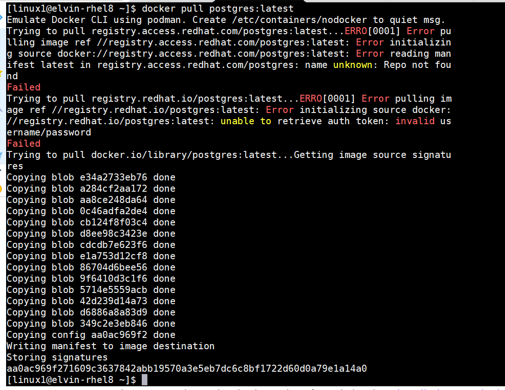

# postgres-on-docker
Running postgresql on docker


  ### Step 2: Install docker
   
   2.1 Start docker service
   ```sh
   sudo system start dockerd.service 
   ```
   2.2 Enable docker service
   ```sh
  sudo system enable dockerd.service 
   ```
   2.3 Check status of the docker service
   ```sh
   sudo systemctl status dockerd.service 
   ```
   
   Optional - Output should look like this
    ### Step 2: Pull postgres docker image
   
   
