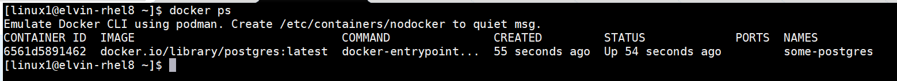

# How to install docker and deploy postgres docker image using LinuxONE Community Cloud
Running postgresql on docker

## Prerequisites
 1. Request access to LinuxONE Community Cloud. Follow instructions [here](https://github.com/Elvin94/LinuxONE-OSS-CC)


  ### Step 1: Install docker
   
   1.1 install docker
   ```sh
   # sudo yum install docker 
   ```
  1.2 Ensure docker installed by checking version
   ```sh
   # sudo docker version
   ```
   
   
  ### Step 2: Download Postgres image
  2.1 Pull postgres docker image  
   ```sh
   # sudo docker pull postgres:latest
   ```
   

  2.2 List docker images 
   ```sh
   # sudo docker images
   ```
   


### Step 3:Running Postgres docker images
  3.1 Run postgres docker image as a container 
   ```sh
   # docker run --name some-postgres -e POSTGRES_PASSWORD=mysecretpassword -d postgres
   ```
   

  3.2 After succesfully running last command, you can now check the running container 
   ```sh
   # docker ps
   ```
   
   
   3.3 Now you can execture Postgres container 
   ```sh
   # docker exec -it some-postgres bash
   ```
   
   
  3.4 connect to postgresql using user postgres 
   ```sh
   # psql -U postgres
   ```
   
